# <span style="color:#FFBDF5"> 2021년 12월의 기록 </span>

---

> ## 2021-12-1 (수) 🌤

<br/>

화이팅! 

열심히 일하고 있습니다. 그런데 가만 보니 필요없는 데이터를 전달하고 필요없는 데이터를 받는.. 이상한 맵핑을 제가 해놨어요.. 😥
<br/>
반성하고 다음엔 좀 침착하게 짜야겠습니다. <br/>
이 상태라면 다시 개발을 시작하는게 더 나을 정도로 스파게티입니다.
그나마 제가 개발자라 ' 아! 이거 그 부분이구나! ' 하고 넘어가지 안 그랬으면 스파게티에 외계인까지 될 뻔 했습니다! 
### <span style="color:#FFBDF5"> #반성합니다 </span>

점심시간 짬을 내어 해보는 개인 프로젝트!
어제는 css가 먹히지 않아서 애를 먹었는데.. 오늘은 어떻게 될런지..

<br/>
오늘 일하면서 느낀 점<BR/>
파라미터 매핑만 알아보기 쉽게 깔끔하게만 해놔도 스파게티가 어느정도 풀린다!<BR/>
빗질하는 정도?

아무리 해도 git으로 이클립스를 공유하는 방법을 모르겠어요.. 저 많은 파일들을 전부 올리면 깃이 터지지  않을까요

<br/>
시간이 지나면 세션이 폐기 되고 그래서 인터셉터에 걸려서 alertMessage가 날아가는군요

어떻게 세션 발급 시간을 알고 있는거지? 어딘가에 로직이 있나? 했는데 세션 자체가 일정시간동안만 살아있고 그 후엔 사라지는군요!

그건 됐고 그럼 그 세션에 대한 설정은 어디서 하는거지..?

<br/>

###### ~~갑자기 드는 생각인데 칭찬이 받고 싶습니다.. 잘 배운다고~~

<br/>
<br/>
String의 equalsIgnoreCase란 메소드를 봤습니다! 이런 좋은 메소드가 있었습니다!<br/>
저도 모르는 자바의 기능들이 많은거 같아요!

``` java
String str = "abc";
"ABC".equalsIgnoreCase(str);
```

---

> ## 2021-12-2 (목) 🌤

<br/>

커피 마시면서 앉아있었는데 과장님께서 context-common.xml을 개발서버에 적용한다고 쪽지를 보내셔서 ' 그게 무슨 파일이지? ' 싶어서 봤더니 <span style="color:#FFBDF5"> Quarts </span>라고 합니다! <br/>
많이 들어봤고 스케쥴러도 많이 들어봤고 어떤 기능인지 대충은 아는데 <br/>
이 기회에 어떻게 사용하는지 한번 보려고 합니다. <br/>

### QUARTS

쿼츠를 보다가 또 파일업로드 메소드를 봤는데 이게 또 궁금합니당!

이것도 볼래요! 😅

``` javascript

//파일 추가
function goInsert(){
    if($('#selectFile').val()==""){
        $('#selectFile').focus();
        alert("등록할 사진을 선택해주세요.");
        return;
    }
    var ext = $('#selectFile').val().aplit(".").pop().toLowerCase();

    if($.inArray(ext,["gif","jpg","jpeg","png"])==-1){
        alert("gif,jpg,jpeg,png파일만 업로드 가능합니다");
        $('#selectFile').val("");
        return;
    }
    var fileSize = 0;
    var maxSize = 1024*1024;
    try{
        fileSize = document.getElementById("selectFile").files[0].size;
    }catch(exception){
        // ie8 오류 무시
    }
    if(fileSize>maxSize){
        alert("용량이 너무 큽니다. \n 1MB이하로 변경해주세요.");
        return;
    }

    if(!confirm("등록하겠습니까")) return;

    $('#uploadForm').ajaxForm({
        url : "insertImg.do"
        ,type : "POST"
        ,enctype : "multipart/form-data"
        ,dataType : "json"
        ,success : function(result){
            var insResult = eval(result);
            if(insResult.resultMsg == "OK"){
                alert("저장 되었습니다.");
            }
        }
        ,error : function(result){
            //저장실패
        }
    }).submit();

}

//파일 미리보기
function previewImg(targetObj, previewId, width, height){
    
    var preview = document.getElementById(previewId);
    var ua = window.navigator.userAgent;
    //Mozilla/5.0 (Windows NT 10.0; Win62; x64) ...
    
    if(ua.indexOf("MSIE")>-1){ //ie
        targetObj.select();
        try{
            var prevImg = document.getElementById("prev_"+previewId);
            if(prevImg){
                preview.removeChild(prevImg);
            }
            var src = document.selection.createRange().text;
            var img = document.getElementByID(previewId);
            img.style.filter = "progid:DXImageTransform.Microsoft.AlphaImageLoader(src='"+src+"', sizingMethod='scale')";
        }catch(e){
            var info = document.createElement("<p>");
            info.innerHtml = "not supported preview";
            preview.insertBefore(info, null);
        }
    }else{ //ie가 아닌 경우
        var files = targetObj.files;
        for(var i=0; i < files.length; i++){
            var file = files[i];
            var imageType = /image.*/; //머야 왜 이따구로 생김
            
            if(!file.type.match(imageType)) continue;
            
            var prevImg = document.getElementById("prev_"+previewId);

            //미리보기 태그 삭제
            if(prevImg){
                preview.removeChild(prevImg);
            }

            //Chrome은 div에 img 뿌리기가 안됨, 생성
            var img = document.create Element("img");
            img.id = "prev_" + previewId;
            img.classList.add("obj");
            img.file = file;
            img.style.width = width+'px';
            img.style.height = height+'px';
            preview.appendChild(img);

            if(window.FileReader){
                var reader = new FileReader();
                reader.onloadend = (function(aImg){
                    return function(e){ 
                        //e = ProgressEvent
                        //target: FileReader
                        // ∟ result : "data:image/png;base64,사진 문자열"
                        //timeStamp
                        aImg.src = e.target.result;
                    };
                })(img);
                reader.readAsDataURL(file);
            }else{ //safari -> 사파리는 FileReader를 지원하지 않음
                var info = document.createElement('<p>');
                info.innerHTML = 'not supported preview';
                preview.insertBefore(info, null);
            }

            
        }
    }
}

<div>
    <input type='text' id='fileName' readony='readonly'>
    <input type='file' id='selectFile' onchange='previewImg(this,"upload_photo","600","400" '/>
    <label for='selectFile' class='file_btn' accept='.gif,.png,.jpg,.jpeg,.bmp'>찾아보기</label>
</div>


```

controller
``` java
@RequestMapping(value="/insertImg.do", method=RequestMethod.POST, produces="text/plain; charset=UTF-8")
@ResponseBody
public String controller(HttpServletRequest req, HttpServeltResponse resp) {
    multipartFile multFile;
    MultipartHttpServletRequest mpReq = (MultipartHttpServletRequest)req;
    Iterator fileNameIterator = mpReq.getFileNames();
    try{
        while(fileNameIterator.hasNext()){
            multiFile = mpReq.getFiles((String)fileNameIterator.next());
            service.insertImg(multiFile);
        }
    }catch(Exception e){
        e.printStackTrace;
    }
}
```
service
``` java
public String insertImg(MultipartFile mp){
    if(mp.getSize() > 0){
        this.insertImgFile(mp);
    }
}

private void insertImgFile(MultipartFile file){
    
    String uploadPath = "/where/ever/you/want";
    
    File uploadDir = new File(uploadPatg);

    if(uploadDir.exists()){
        uploadDir.mkdir();
    }

    //파일 풀네임 (파일네임+확장자)
    String orgFileFullName = file.getOriginalFileName();
    //파일네임
    Stirng FileFullName = orgFileFullName.subString(0, StringUtils.lastIndexOf(orgFileFullName,"."));
    
    //파일 확장자
    String fileExt = orgFileFullName.subString(StringUtils.lastIndexOf(orgFileFullName,"."),orgFileFullName.length());
    //서버에 저장될 이름
    String fileName = "서버에 저장하고 싶은 이름 암거나";
    File targetFile = new File(uploadPath, fileName+"."+fileExt);
    
    file.transferTo(targetFile);

    dao.insertImgFile(orgFileFullName);


}
```

잠깐 PM님이 부르셔서 나가서 커피 한잔 하고 왔는데...
ㅓㅇ... 처음부터 끝까지 한번 혼자서 개발 해보라고 하십니다..
배포까지인거 같은데 제가 배포를 한번도 혼자 해본적이 없어서 큰일입니다..


---

> ## 2021-12-3 (금) 🌞

<br/>

아무도 알려주지 않아서 모르겠다는 말은 변명이에요 <br/>
전 여기서 1년동안 아무도 알려주지 않아서 어쩔 수 없구나.. 초보니까 믿고 맡겨주시지 않는구나 했습니다.<br/>
아무도 알려주지 않아도 혼자서 알아가야한다. <br/>
그래서 회사의 모든 접근 가능한 문서를 뒤지고 있습니다. <br/> 
내가 알아갈 정보가 하나라도 있기를 <br/>

제가 일하고 있는 사업단은 지리정보를 기반으로 운영되는 사업단입니다.
세상에 저는 openLayers가 있다와 어느정도 뭐가 뭔지 대충 알고만 있으면 되겠지 싶었습니다만..
.shp 파일은 처음 봅니다.
그래서 알게 된 김에 .shp 파일에 대해서 조금 적어 가볼까 합니다.

###### 참고자료
###### [위키백과](https://en.wikipedia.org/wiki/Shapefile)
<br/>

## .shp : ShapeFile
지리적 위치 및 관련 속성 정보를 저장하기 위한 디지털 벡터 저장 형식입니다.


---

> ## 2021-12-6 (월) 🌞

반성할 일이 생겼습니다.. <br/>
저번주부터 열심히 공부하고 일 해놓고는 커밋을 이틀 연속으로 까먹었습니다. 😥

오늘 DBian 카페의 글을 보다가 오프라인 강의를 보았습니다.
59만원정도 했는데 신청했습니다.<BR/>
아직 결제는 안 했지만.. 할부가 되면 좋겠군요..😂

저는 오늘 SQL문을 들여다 볼 예정입니다!

오라클의 옵티마이저가 정말 궁금해서 <br/>
[DBian 옵티마이저](https://cafe.naver.com/dbian/4385)
참고해서 공부하고 있습니다.

제 쿼리가 느리단 얘기는 계속 듣고 있고 이를 고쳐보고 싶어서 여러방면으로 노력중입니다.
현재 ORACLE의 HINT라는 기능을 살펴보고 있습니다.

현재 제 쿼리는 3개의 테이블을 JOIN 중입니다! <br/>
그래서 이 JOIN의 순서를 바꿔주는 HINT를 찾은거 같습니다!

과장님께서 이제 곧 없어질 홈페이지지만 수정할 부분 하나만 수정해달라고 하셔서.. 
과장님께서 주신 이클립스 압축파일을 풀었는데.. 오류투성이입니다.. 환경설정 안 해도 되도록 전부 압축해서 주셨다는데.. 😅😅

그렇게 과장님이 주신 과제 하다가 신기한걸 봤습니다!
개발자센터라고 따로 개발자들을 위한 API를 제공하는 페이지에서 발견한 코드입니다!

```javascript

var xmlHttp;

function first(){
    var url = "/***.do?***=***";
    createXmlHttp();
    xmlHttp.onreadystatechange = handlerStateMonthChangeFile; // 뭐야 이거 함수였어
    xmlHttp.open("GET", url, true);
    xmlHttp.send(null);
}

function createXmlHttp(){
    if(xmlHttp!=null){
        xmlHttp.abort(); //abort()가 도대체 뭔가
        delete xmlHttp;
        xmlHttp = null;
    }
    if(window.ActiveXObject){
        xmlHttp = xmlVersionCheck();
    }else if(window.XMLHttpRequest){
        xmlHttp = new XMLHttpRequest();
    }
}
function xmlVersionCheck(){
    var version = ["Msxm12.XMLHTTP.6.0","Msxml12.XMLHTTP.3.0","Microsoft.XMLHTTP"];
    for(var data in version){
        try{
            var xmlDom = new ActiveXObject(version[data]);
            return xmlDom;
        }carch(ex){}
    }
    return null;
}

function handlerStateMonthChangeFile(){
    if(xmlHttp.readyState==4){
        if(xmlHttp.status==200){
            var a = xmlHttp.responseXML.getElementByTagName('a');
            var arr = xmlHttp.responseXML.getElementByTagName('b');
            console.log(arr[0]); // xmlHttp에 담겨오는 XML은 ARRAY도 가능합니다
        }
    }
}

```
[XMLHttpRequest | 참고](https://developer.mozilla.org/en-US/docs/Web/API/XMLHttpRequest/readyState)

URL을 타고 들어가면 XML파일이 나옵니다 거기서 TAG들을 끌어와 쓰는 로직입니다.

대단해요.. 이런걸 어떻게 만드는건지...


---

> ## 2021-12-7 (화) 🌞

현재 진행중인 프로젝트 
1. 내 블로그 (jquery, spring, tomcat, oracle)
2. 선거구 획정 프로그램 (jquery, spring, tomcat, geoserver, postgre)

web.xml -> welcom-file -> login.do -> UserController.java 

loginProcess.do (로그인 판별) -> 로그인 성공시 -> opertList.do

이 프로젝트에선 암호화 알고리즘을 SHA-256 을 사용합니다.
spring security, aria만 쓰다가 sha는 처음 보는거 같아요.

항공지도 
http://210.117.198.120:8081/o2map/services?service=WMTS&request=GetTile&version=1.0.0&layer=AIRPHOTO&style=_null&format=image/jpg&tilematrixset=NGIS_AIR&tilematrix=17&tilerow=15317&tilecol=9188&apiKey=1482BA6C941C4BA57FD8CDA5CFF4C3AE

기본지도
http://localhost:8085/openapi/Gettile.do?service=WMTS&request=GetTile&version=1.0.0&layer=korean_map&style=korean&format=image/png&tilematrixset=korean&tilematrix=L17&tilerow=15320&tilecol=9194&apikey=1482BA6C941C4BA57FD8CDA5CFF4C3AE

백지도
http://localhost:8085/openapi/Gettile.do?service=WMTS&request=GetTile&version=1.0.0&layer=white_map&style=korean&format=image/png&tilematrixset=korean&tilematrix=L17&tilerow=15318&tilecol=9191&apikey=1482BA6C941C4BA57FD8CDA5CFF4C3AE

GeoServer 다운로드 위치 
C:\Program Files (x86)\GeoServer 2.8.5

###### ~~나는 아무것도 하는 일이 없다.. 내가 이 무시들 다 버텨낸다 내가 진짜.. 내가 여기 사업단 기술 다 배워서 이직한다 진짜.. 눈물나요.. 팀장님이 이것저것 말 걸다가 마저 쉬세요 하는데.. 나 일하려고 여기 왔는데 어이없어서 눈물납니다.~~

<br/>
<br/>

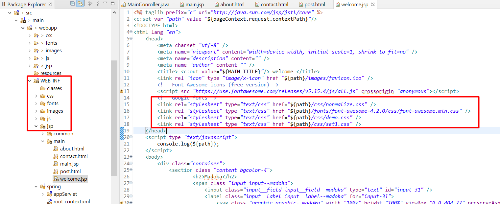

js와 css 못찾은 이유를 찾았습니다!
WEB-INF 안에 있던 정적문서들을 webapp 아래로 옮겼더니 해결 됐습니다.

* 문제 1
    - 인코딩 에러 발견
* 해결 1
    - jsp에 인코딩 태그
    - encodingfilter 설정
``` JSP

<%@ page language="java" contentType="text/html; charset=UTF-8" pageEncoding="UTF-8" %>

```
```xml
    <filter>
		<filter-name>encodingFilter</filter-name>
		<filter-class>org.springframework.web.filter.CharacterEncodingFilter</filter-class>
		<init-param>
			<param-name>encoding</param-name>
			<param-value>utf-8</param-value>
		</init-param>
	</filter>
	<filter-mapping>
		<filter-name>encodingFilter</filter-name>
		<url-pattern>*.do</url-pattern>
	</filter-mapping>
```


[ 지시자 : <%@   %> ]

JSP 페이지가 컨테이너에게 필요한 메세지를 보내기 위한 태그 <br/>
page : JSP 페이지의 전체적인 속성을 지정 <br/>
include : 다른 페이지를 현재 페이지에 삽입 <br/>
taglib : 태그라이브러리의 태그 사용 <br/>
범위 : JSP 파일 전체 (클래스를 import 할 경우 파일 내 어디서든 접근할 수 있음) <br/>

``` jsp
<%@ page import="java.util.Arrays"%>
<%@ page language="java" contentType="text/html; charset=UTF-8" pageEncoding="UTF-8"%>
<%@ taglib uri="http://java.sun.com/jstl/core" prefix="c" %>
 ```

page는 대부분 import나 에러 페이지 삽입 등의 용도로 많이 사용

[참고](https://codevang.tistory.com/197)


* 문제 2
    - javascript function이 찾아지지 않는 문제 발견
* 해결 2
    - jquery 가져오는 ```<script>``` 를 제대로 닫지 않아서 생긴 문제
    

집에 와서 마저 해보려고 합니다.

* 문제 3 
    - pom.xml 에러
        - Could not initialize class org.apache.maven.plugin.war.util.WebappStructureSerializer

* 해결 3
    - 오류는 있지만 톰캣에 올렸을 때 실행은 됩니다.. 왜 그런지 정말 xml버전 문제인지..


---

> ## 2021-12-8 (수) 

<br/>

아침부터 어이없을 무 <br/>  
js가 잘 안되길래 왜 안돼 하고 삽질하고 있었는데요.. <br/>
갑자기 됩니다! 좋은게 좋은거지 뭐

나 그래서 왜 지오서버가 맘대로 안 되는거죠??? 왜 이러지?????

### 혼자서 프로젝트를 해보려니 맨땅에 헤딩하는 느낌이고.. 날 이끌어줄 누군가가 필요하다.. 프로젝트를 하는 방법을 배우고 나도 연차가 쌓이고 실력이 쌓이면 후배를 이끌어 줄 선배가 되고 싶다.

---

> ## 2021-12-9 (목) 

<br/>

GeoServer 랑 PostGre 연결중 발생한 에러로그

```
org.postgresql.util.PSQLException: 오류: am.amcanorder 칼럼 없음
  Position: 427
```

이거 해결해서 팀원들에게 알려줘야 하기 때문에 기록합니다.

내가 한 일 

1. C:\GeoServer 2.8.5\etc\jetty.xml 파일 수정
    * 포트 변경을 위해 수정했습니다.

``` xml
 <!-- <Call name="addConnector">
      <Arg>
          <New class="org.mortbay.jetty.nio.SelectChannelConnector">
            <Set name="port"><SystemProperty name="jetty.port" default="8082"/></Set>
            <Set name="maxIdleTime">30000</Set>
            <Set name="Acceptors">2</Set>
            <Set name="confidentialPort">8443</Set>
          </New>
      </Arg>
    </Call> -->
        

    <!-- Use this connector if NIO is not available. -->
    <Call name="addConnector">
      <Arg>
          <New class="org.mortbay.jetty.bio.SocketConnector">
            <Set name="port">8088</Set>
            <Set name="maxIdleTime">50000</Set>
            <Set name="lowResourceMaxIdleTime">1500</Set>
          </New>
      </Arg>
    </Call>

```

2. C:\GeoServer 2.8.5\data_dir\workspaces\edsp\edsp\datastore.xml 파일 수정
    * postgre db 연결을 위한 password 설정을 위해 수정했습니다.

``` xml

    <entry key="port">5432</entry>
    <entry key="passwd"> 비밀이지롱 ~ 😎 </entry>
    
```

3. 검색 결과 : 코드의 문제가 아닌 postGre 자체의 문제, jdk와 PostGre 버전이 안 맞는 거라고 한다(?)

어찌저찌 GeoServer는 켰는데... 로그인하라는 창을 최상단에서 발견했다.
음.. 근데 사용자들은 자동 로그인 될 거 아닌가..? 
C:\GeoServer 2.8.5\data_dir\security\usergroup\default\users.xml
그래서 로그인 정보가 있을만한 설정 파일을 찾아봤다.
이건거 같은데..


## geoserver란 
내가 서울특별시 지도를 보고 싶다 -> 웹 접속해서 서울특별시 클릭 -> DB접속 -> DB에서 서울특별시 정보를 가지고 -> geoserver 접속 -> 이미지 -> 리턴 -> 짜잔 지도~!!


## WMS가 뭐지??
* Web Map Service(WMS)
    * GIS 데이터에 접근하기 위한 인터페이스로써 웹을 통해 지도 이미지(형식)로 서비스함. 다시 말해, 데이터서버에 저장된 레이어 또는 분석을 통해 생성된 벡터 및 래스터 데이터를 시각화 하는 서비스

* Web Feature Service(WFS)
    * 웹을 통해 벡터형식으로 GIS 데이터를 제공하기 위한 인터페이스로, 데이터서버에 저장된 벡터 레이어를 공간 및 속성조건을 이용해서 불러오거나 관리(피쳐의 추가, 수정, 삭제) 하기 위한 서비스

* Web Coverage Service(WCS)
    * 웹을 통해 래스터 형식을 GIS 데이터를 제공하기 위한 인터페이스, 위성영상 등과 같은 자료를 서비스

* Web Processing Service(WPS)
    * 지리정보에 대한 다양한 처리 서비스(Geo-Processing Service)를 웹상에서 정의하고 접근할 수 있도록 하기 위한 인터페이스, 모든 OGC 표준 웹 서비스들과 상호호환성을 갖도록 정의

[참고](https://dzzienki.tistory.com/47) <br/>
[참고2](https://rlawls1991.tistory.com/entry/GeoServer-PostGIS)


## 찾았다 요놈.... 

C:\apache-tomcat-8.5.71\bin\ff.txt
이게 jdk와 모든걸 c:\에 넣게 한 주범입니다

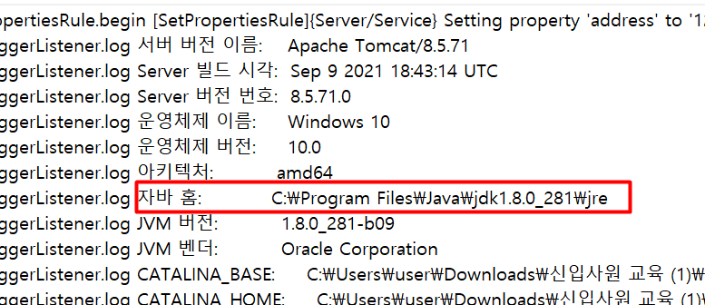

뭐야 너 어디보고 있는거야.. 그 jdk 아닌데


---

> ## 2021-12-13 (월) 

<br/>

``` HTML
<article class="layer-modal layer-over" id="popup_opert_add">
</article>
```

HTML에서 ```<article>``` 이란 태그를 처음 봅니다!


## edsp 요구사항
1. 작업 복사 오류 :  작업 복사하면 복사는 되는데 내용이 없음
    - 내 컴퓨터에서는 잘 되는데 더 상세하게 어떤게 안 되는지, 프로그램 실행 환경은 어떤지, 실행 했을 때 LOG 파일에 오류가 찍히는건 없는지 확인 해야함

2. 선거구 색상 오류 :  선거구가 기 등록된 상태에서 신규 선거구를 생성하면 도형의 색상이 첫번째 선거구와 동일하게 셋팅되어 인지가 안됨


postgreSQL엔
```
ORDER BY OPERT_SN DESC LIMIT 1;
``` 
이런 문법도 있습니다 LIMIT 1
LIMIT는 조회한 결과 값의 행의 수를 제한, 한정하는 역할을 합니다.

지금까지 계속되던 고민이 있습니다.

현재 배포를 
C:\apache-tomcat-8.5.71\webapps\ROOT 이 폴더에 프로그램을 넣어서 배포했습니다만
그러면 제가 배포하고 난 뒤 수정사항을 수정하고 난 뒤 클라이언트에게 톰캣을 다시 드려야 하는 번거로움이 있는데 개발자커뮤니티에 물어보니 
### 자동화툴(젠킨스) 같은게 있다고 합니다. 
한번 살펴보는게 좋을거 같아요.
사수도 없어 배포까지 한다는게 얼마나 어려운 일인지.. 
###### ~~사수 없으면 그냥 하면 되지 싶었던 예전의 생각을 고쳐 먹었습니다.~~

오늘 이 war 배포에 대해서 여쭤보면서 들었던 얘기들

#### 이참에 cicd한번 공부하시죠 ㅋㅋ 
#### 젠킨스 공부해보세여
#### deploy하는것도 어렵지않으니 해보셔도될듯..
#### ftp로걍 넘기는거보면 걍온프라미스에 컨테이너안쓰나보네요
#### ftp로 업로드 후 톰캣 껐다키면 배포 끝 이건가요?!
#### 내컴에서 github에 푸시하면 서버에 빌드 테스트 배포까지 다되는경험을 해보신적있나요
#### devops에 입문하시죠  


---

> ## 2021-12-14 (화) 

<br/>

## edsp 요구사항
1. 작업 복사 오류 :  작업 복사하면 복사는 되는데 내용이 없음
    - 제 컴퓨터에서는 잘 되는데 더 상세하게 어떤게 안 되는지, 프로그램 실행 환경은 어떤지, 실행 했을 때 LOG 파일에 오류가 찍히는건 없는지 확인 해야함

2. 선거구 색상 오류 :  선거구가 기 등록된 상태에서 신규 선거구를 생성하면 도형의 색상이 첫번째 선거구와 동일하게 셋팅되어 인지가 안됨

3. interceptor의 부재 : 요 며칠 코드를 살펴본 결과 모든 경로에 대해 세션검사를 하지 않는다는걸 확인 했습니다. 이렇게 인터셉터나 필터로 세션검사를 하지 않고 프로그램이 실행 되는건 보안상으로도 사용상으로도 좋은 결과가 아니므로 인터셉터 적용 고려


유지보수 하다가 보니 주석이 하나도 안 되어있는 코드에 화가 나기 시작했습니다.
나는 그러지 않을거야... 

login.do -> opertList.do -> edspManage.do?opertSn=2 -> edsp/viewEstrelmList.do -> edsp/estWfs.do -> getSigCenterCoord.do


### 일반지도타입 클릭시

```javascript
function mapType(type){
	$(".map_choose .selMapType").removeClass("airphoto");
	$(".map_choose .selMapType").removeClass("normal");
	$(".map_choose .selMapType").removeClass("white");
	$(".map_choose .selMapType").addClass(type);
	$(".map_choose .selMapType").addClass("on");
	$(".map_choose button.noneMapBtn").removeClass("on");
	if(type == "airphoto"){
		ngiiAirLayer.setVisibility(true);
		map.setBaseLayer(ngiiAirLayer);
		$(".map_choose .selMapType").text("항공지도");
	} else if(type == "normal"){
		ngiiNormalLayer.setVisibility(true);
		map.setBaseLayer(ngiiNormalLayer);
		$(".map_choose .selMapType").text("일반지도");
	} else if(type == "white"){
		ngiiWhiteLayer.setVisibility(true);
		map.setBaseLayer(ngiiWhiteLayer);
		$(".map_choose .selMapType").text("백지도");
	}
}
```

```
ngiiNormalLayer = new OpenLayers.Layer.TMS(properties.tileNames_en[0].NAME,properties.tileUrls[0], properties.baseLayerOptions);
```

properties가 뭐지? 

properties = ngii_wmts.map.properties

이제 알았습니다.. 국토정보플랫폼의 api를 가져다 쓰는 중이었군요🙄
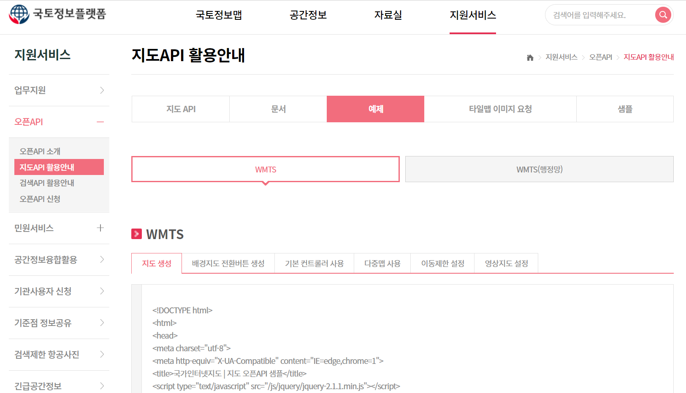
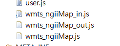

o2Map이라는 gis를 사용하고 있었군요..
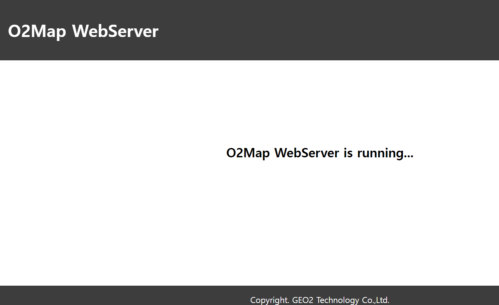
아니 ArcGis도 쓰고 난리가 났네?
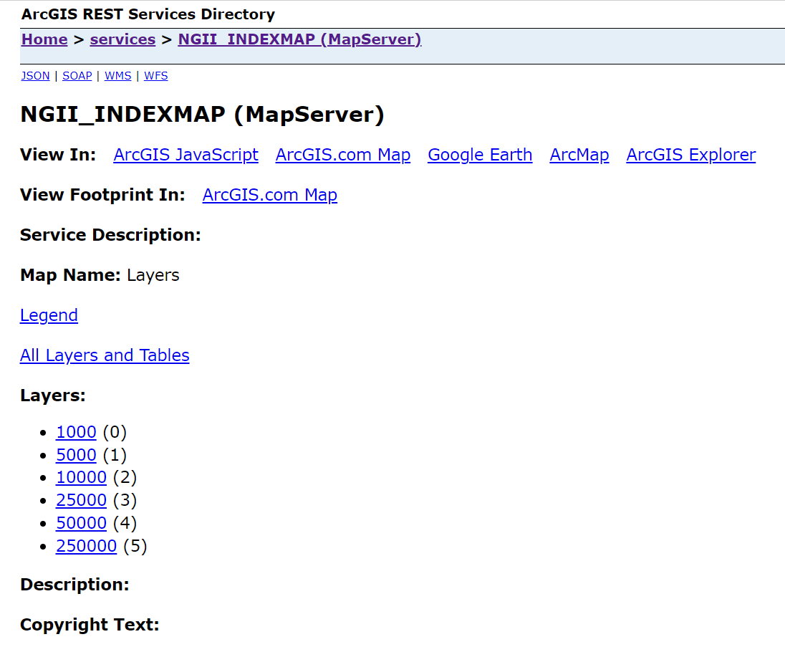


tomcat에서 war파일 배포시 contextRoot를 찾지 못하던 에러 해결했습니다
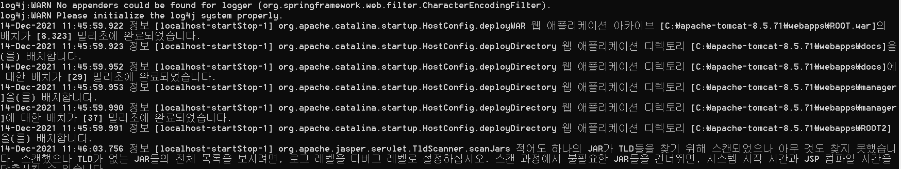
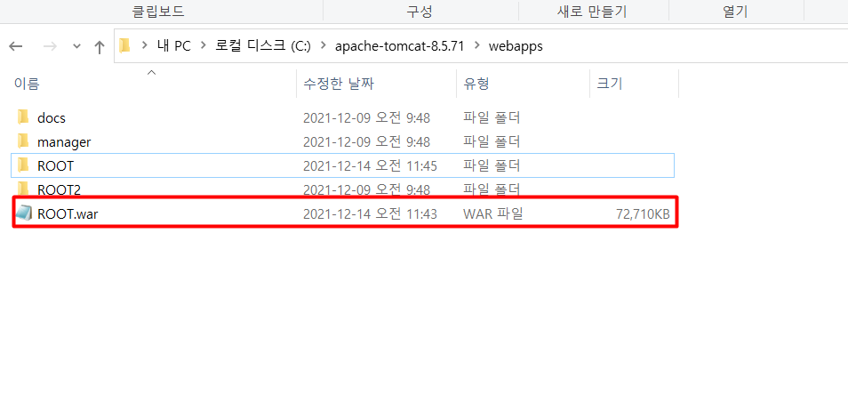
ROOT란 이름으로 war를 말아버리고 기존에 있던 ROOT를 다른거로 변경했습니다~😀

```
map = new OpenLayers.Map('edspMap', options);

-----------

var options = {
		projection: new OpenLayers.Projection("EPSG:5179"),
		displayProjection: new OpenLayers.Projection("EPSG:5179"),
		units: "m",
		maxResolution : 2048,
		//maxResolution : 1954.597389,
		maxExtent: new OpenLayers.Bounds(
			213568, 1213568,
			1786432, 2786432),
		numZoomLevels:13,
		controls: [
			        new OpenLayers.Control.Navigation({
			            dragPanOptions: {
			                enableKinetic: false}}),
				    new OpenLayers.Control.Attribution(),
			        new OpenLayers.Control.KeyboardDefaults()
				]
	};

```

---

> ## 2021-12-15 (수) 

<br/>

팀원이 셋인데 세명 모두 로컬 db에 접속해 서로 다른 db를 사용하고 있어서 이건 문제가 있다 싶어서 db를 하나로 통일했습니다!

그래서 그 방법을 기록하려고 합니다.

## 1. conf 파일 설정
C:\Program Files\PostgreSQL\12\data\pg_hba.conf 에 
ipV4 아래에 <br/>
### host    all             all             0.0.0.0/0            md5
설정을 해서 모든 ip 허용으로 해둡니다.


C:\Program Files\PostgreSQL\12\data\postgresql.conf 에 
### listen_addresses = '*'
설정을 해서 모든 주소 허용으로 해둡니다.

## 2. 방화벽 설정
그러고 방화벽에서 inbound 규칙으로 postgres port를 허용해주면 끝!

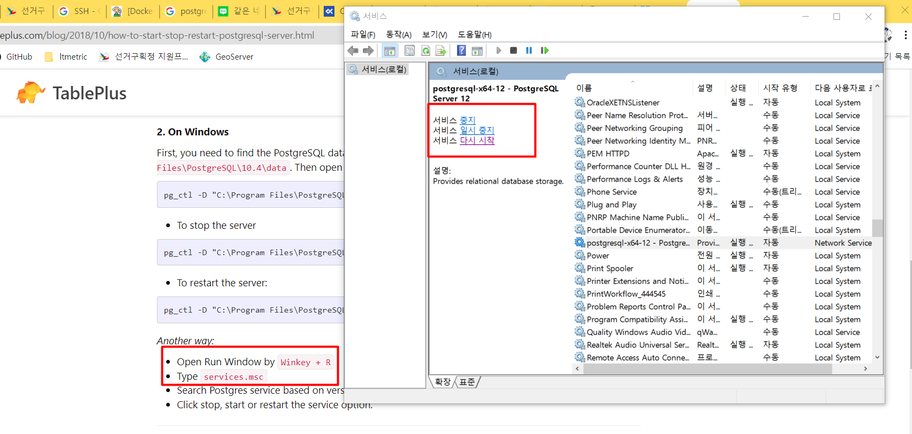

[참고1](https://wiki.mcneel.com/ko/zoo/window7firewall) <br/>
[참고2](https://hgko1207.github.io/2020/09/11/postgresql-2/)

그렇게 db 연결하고 나니까 geoserver에서 불러오는게 다른가 봅니다.. 
서로 뜨는게 다르다고 하네요

geoserver도 같은 방식으로 연결했습니다.

svn을 사용해볼까 합니다 svn하는김에 jenkins도 할겁니다.

[참고1](https://oingdaddy.tistory.com/207)<br/>

svn연결을 하는데서 막혔습니다. 공유기를 통해 로컬로라도 연결 해보려고 하는데 공유기가 잠겨있습니다.. 


---

> ## 2021-12-16 (목) 

<br/>

잘하고 있는거겠찌..?

오늘 아침엔 SQL 튜닝 책 보는중

[SQLDEVELOPER 단축키 참고](https://jhnyang.tistory.com/325)

오늘 svn연결도 다 했습니다.

PM님께서 보시기엔 꽤나 오래 걸린것 같아 보이시겠지만 실제로 3일 걸렸고 전 절대 오래 걸리지 않았다고 생각합니다.

처음 써보는 SVN, 처음 써보는 POSTGRESQL에 TOMCAT에 WAR파일 배포할 줄도 모르던 초보가 여기까지 했단것 만으로도 충분히 잘 했습니다.

이 프로젝트는 아무도 유지관리하는 분이 없는 프로젝트이고 산출물 또한 사용자 지침서 밖에 없습니다.

산출물 작업을 해서 다음에 유지보수 하는 사람들을 편하게 해줄 생각입니다.

물론 저희도 더 편하게 작업 할 수 있게 되겠죠?

저는 UML을 작성할 생각입니다.

ERD도 그려보고, 약어설명서도 써보고

그렇게 나올 산출물 목록을 적어두겠습니다.

## 산출물 목록
- 논리물리 ERD
- 약어설명서
- 화면설계서
- UI 목록
- 테이블 정의서
    - 컬럼정의서
- UML (아직 뭘로 할지 미정)
- 프로그램명세서

---

> ## 2021-12-21 (화) 

<br/>

산출물 목록을 보다가 소스코드 보안약점 점검결과 파일을 보았습니다.

여기 사업단은 BigLook V6.0 을 사용해 자동진단을 합니다.

## ServletContextListener
웹 어플리케이션이 시작되고, 종료될 때 특정한 기능을 수행

등록 방법

web.xml
``` xml
<listener>
	<listener-class>리스너 클래스 경로</listener-class>
</listener>
```

[server.xml 참고](https://indienote.tistory.com/496) <br/>
[web.xml의 파람 참고](https://erjuer.tistory.com/20)


## 크로스도메인이슈

### JAVA 단에서 Header에
response.setHeader("Access-Control-Allow-Origin", "*"); //CROSS DOMAIN <br/>
교차 출처 리소스 공유 (CORS)

자신의 출처와 동일한 리소스만 불러올 수 있으며, 다른 출처의 리소스를 불러오려면 그 출처에서 올바른 CORS 헤더를 포함한 응답을 반환해야 합니다.

### JSP AJAX 에서 

[참고](http://www.codejs.co.kr/jquery-jsonp/)

### 작업현황 & 공유작업 리스트 목록을 화면에 뿌리는 과정

wellcome -> login.do -> loginProcess.do -> opertList.do 
-> function viewOpertList(pageIndex) (JS) -> viewOpertList (JAVA) return mav -> viewOpertList.jsp (여기 안에 데이터 매핑해서) -> $("#opertListWrap").html(data)

왜 어떻게 document.ready가 없는데도 어떻게 문서 로드 되자마자 스크립트가 실행되지 싶었는데
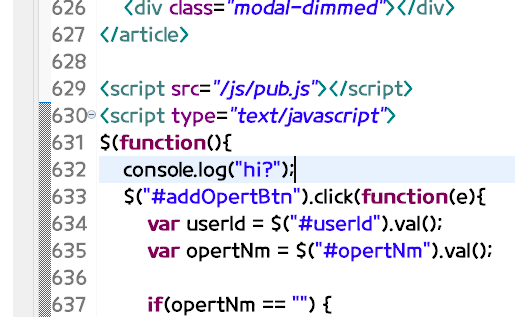
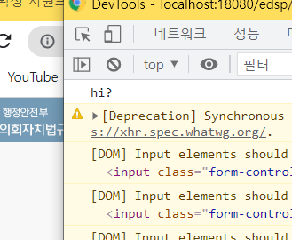

이런 방법이 있군요! 신기해서 적어봤습니다!

---

> ## 2021-12-22 (수) 

<br/>

### JS 소스코드 난독화 (개발자 창에서 숨기기)

working 산출물 보다가 JavaScript 코드 난독화를 봤습니다!

우선은 안드로이드 앱 상에서의 난독화기는 했는데 그래도 알아보고 싶어서 찾아봤습니다


jboss??

어후.. 하루종일 산출물 작업 했습니다...

열심히 코드 정리하다가 이런걸 써봤습니다.
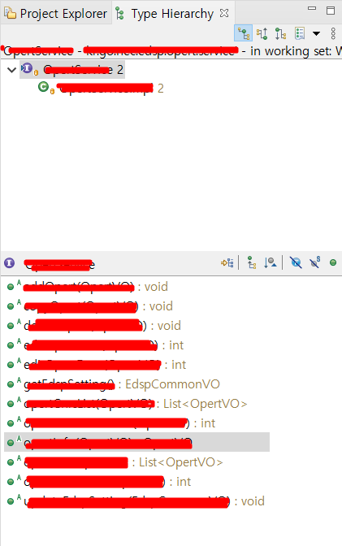

Type Hierachy를 열면 이렇게 메소드들이 주르륵 뜨더라구요! 신기!!
