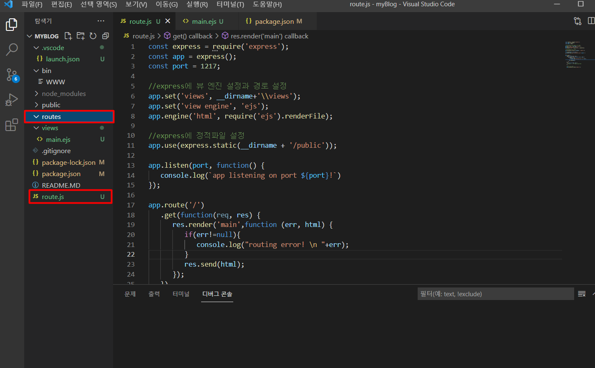
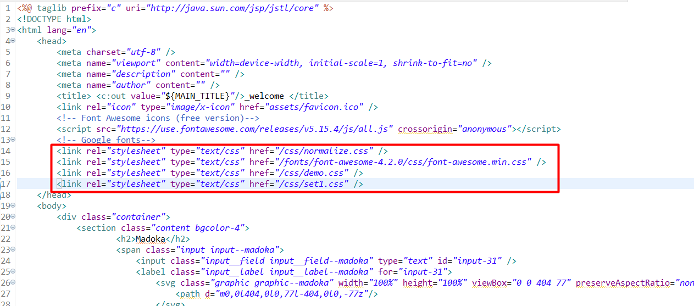

# <span style="color:#FFBDF5"> 2021년 11월의 기록 </span>

###### 이 기록을 남기는 이유는 매일매일 얻어가는 지식이 있기를 바라는 마음에서 하는 기록입니다.
<br/>
<br/>
매일 헷갈리는 나를 위한 git 사용법 <br>
https://rogerdudler.github.io/git-guide/index.ko.html

> ## 2021-11-10


### 1.

 iframe을 통해 엑셀 파라미터를 보내는 방식이었습니다. <br/>
엑셀 다운로드 버튼을 누르면 JS에서 아이프레임으로 파라미터를 넘기는 방식이었는데 파라미터가 보내지기는 하지만 처음 보낸 파라미터가 다음 전송시에도 바뀌지 않고 중복해서 보내지는 문제가 있었습니다. <br/>
첫번째로 확인 했던 부분은 ```@RequestParam```입니다. <br />
```@RequestParam```이 초기화가 안 되는줄 알았습니다. <br/>
혹은 어디선가 같은 변수 이름으로 전역변수를 사용하고 있고 그래서 계속 전역변수를 호출 하는줄 알았습니다.<br/>
그렇게 ```@RequestParam```을 살펴보는 삽질을 하던 중<br/>
대리님께서 iframe을 손수 remove 해야 한다는 힌트를 주셨습니다.
``` javascript
if($('iframe')!=undefined){
    $('iframe').remove();
}
```
덕분에 잘 해결했습니다. 😄

### 2.

```jsp
<%@ taglib prefic='fn' uri='jstl/functions' %>
```
이게 도대체 모징?

<br/>


---

> ## 2021-11-15 (월)

### 1. 
지금까지 안돼서 애 먹었던 manifest.xml 파일 오류를 해결했습니다.
해결한 코드는 아래입니당.

```xml
<application
        android:allowBackup="true"
        android:icon="@mipmap/ic_launcher"
        android:label="My First App"
        android:roundIcon="@mipmap/ic_launcher_round"
        android:supportsRtl="true"
        android:theme="@style/Theme.MyFirstApp">
        <activity android:name=".MainActivity"
            android:exported="true">
            <intent-filter>
                <action android:name="android.intent.action.MAIN"/>
                <category android:name="android.intent.category.LAUNCHER"/>
            </intent-filter>
        </activity>
    </application>
```
applicatiob 안에는 원래 activity도 intent-filter도 없었는데 이 둘을 추가해서 해결했습니다.

그 중에서도 activity에 ``` android:exported="true" ``` 를 꼭 해줘야 한다고 합니다.

---

> ## 2021-11-17 (수)

오늘 지금까지 시험삼아 개발했던 인접시군구 영향도 라는 기능을 다시 실행시켰더니 갑자기 오류가 납니다. <br />
얼마전까진 참 잘 됐던거 같은데.. <br /> 
분명 값을 가져와야하는 상황인데 undefined이라고 뜨는 상황입니다.<br/>
이 undefined에 대한 처리가 부족한 것 같습니다.. <br/>
어떻게 해야 이런 예외상황에 잘 대처할 수 있는지.. 잘 모르겠습니다,,

<span style="color:#FFBDF5">
오후근무시간중 마주친 이상한일 <BR/>
데이터가 들어와서 가는 테이블은 한 곳인데<BR/>
왜? 웹으로 출력할 땐 테스트한 데이터가 안 보이는거지? 어떻게 한걸까요?

내가 추측컨데 들어올때 
**WEB.XML -> DISPATCHER-SERVLET.XML -> InterceptorHandlelingController.java**
이렇게 오면서 테스트서버와 테스트서버가 아닌걸 판가름하고

DB서버를 다르게 태워 보내는 방식인건가

</span>

---

> ## 2021-11-18 (목)

어제 조대리님께서 알려주신 방법을 써보자! 홧팅! 아자아자! <BR/>
하려다가 시험이 이틀 남았던걸 깨달았고 아치 싶어서 급하게 시험공부에 돌입했습니다. <BR>
이번 시험이 끝나면 할 일들이 많아요.<BR/>
리스트로 나열 해보자면 <BR/>
1. 업무구조도, INSERT와 UPDATE 류차장님 소스 노려보면서 내꺼 수정하기
2. 시군구 영향도 조회, 조대리님 소스 노려보면서 내꺼 수정하기
3. 다음 시험 일정 알아보기 (떨어질게 뻔하니까.. 괜찮아!!)
4. 삼성 노트북 포맷하고 이클립스, SQLdeveloper, VSC 환경설정 다시 하기

---

> ## 2021-11-19 (금)

오늘 공부하면서 오라클에서 행을 열로 반환해주는 **PIVOT**이란 기능을 봤습니다<BR/>
11G부터 지원하는 기능이라는데 그 전에는 DECODE를 이용해 행을 열로 반환했다고 합니다.<BR/>
오늘 회사에 가서 DECODE를 이용해 행을 열로 반환한 쿼리가 있는지 구경할 예정입니다!

출근하고 보니 어제 하던 배포가 오류가 났나봅니다 <BR>
오늘따라 CLOB, CLOB 하면서 오류가 나서 난리인것 같은데.. <BR/>
<BR/>

**CLOB** : 캐릭터 라지 오브젝트(Character large object, CLOB)는 데이터베이스 관리 시스템에 쓰이는 문자 데이터, Oracle Server는 CLOB과 VARCHAR2 사이에 암시적 변환을 수행

BLOB도 있어요<BR/>
**BLOB** : 바이너리 라지 오브젝트(Binary large object, BLOB)는  데이터베이스 관리 시스템의 하나의 엔티티로서 저장되는 이진 데이터의 모임,  그림, 오디오, 또는 기타 멀티미디어 오브젝트인 것이 보통이지만, 바이너리 실행 코드가 BLOB으로 저장되기도 한다.


<BR/>
SQLD 공부중 정규표현식이 나와서,,

<BR/>
'A'로 시작하고 'H'로 끝나는 정규 표현식<BR/>

``` 
(^A.+?H) 
```
'A','B' 둘 다 제외한 문자열을 찾는 정규 표현식 <BR/>
[^ ] = NOT이란 뜻입니다

```
[^AB]
```
숫자가 아닌 문자만 검색하는 정규표현식 <BR/>
```
\D
```
...

아직도 정규표현식을 잘 모르겠습니다.. **화이팅**


## <span style="color:#FFBDF5"> 우연히 읽은 한 기사 내용 </span>

아래는 2016년 DAP,SQLP,ADP 데이터 관련 자격증을 연거푸 딴 **김창훈** 이란 분의 인터뷰 내용이다

>이때부터 제가 해왔던 분야의 자격증을 알아봤는데 하나도 갖고 있는 게 없는 겁니다. 국민 자격증이라는 정보처리기사 자격증도 없었으니까요. 우선 정보처리기사 시험부터 합격하고 나서 합격률 6~7%라는 정보보안기사 시험에 합격하고 나니 자신감이 붙더라고요. 그래서 ‘70살 넘어서도 할 수 있다’는 말에 정보감리사 시험을 준비했는데 이 역시 합격했어요.
준비 기간이 그리 길지 않았는데도 꽤 좋은 점수를 받았고요. 하지만 정보감리사 시험의 마지막 관문인 실무교육을 받으면서 ‘내가 이런 상태에서 감리업무를 잘 할 수 있을까’ 하는 생각이 들더군요. 감리사 시험은 능력 검증이 아닌, 감리 업무를 할 수 있는 자질 검증 시험이었어요. 그때 감리사 채용 광고를 보면, DAP 우대라는 말이 자꾸 나오더라고요. 20년 넘게 개발자로 일해오면서 DB 튜닝과 데이터 모델링을 제대로 한번 해보고 싶다는 생각을 갖고 있었으므로 잘됐다 싶었죠.
DAP부터 준비했는데, 데이터 모델링 중심의 시험이라는 걸 그때야 알았습니다. DAP 시험 합격 후에 튜닝 실력을 쌓을 수 있는 SQLP까지 준비해 역시 합격했죠. 여세를 몰아 ADP라는 자격증까지 따고 싶다는 생각이 들더라고요. 그때 알파고 인기로 인공지능이 이슈가 되면서 ADP 자격증을 더해 3관왕을 해보고 싶어졌습니다.

> “SQLP 공부를 하고 나서 20년 넘게 개발자로서 제가 짜왔던 쿼리문이 얼마나 부끄러운 수준이었는지 알게 됐습니다.
고민하면서 짠 쿼리문은 올라간 성능으로 대답해줬습니다. … 커트라인만 넘기는 수준의 공부는 별 도움이 안 되었어요.
제가 자격증 공부를 통해 얻으려고 했던 그 이상을 얻으려면 공부를 훨씬 더 많이 해야합니다.
어쩌면 합격은 그러한 공부 과정 속에서 당연히 주어지는 게 아닐까 합니다.”

> 제가 자격증 공부를 통해 얻으려고 했던 그 이상을 얻으려면 공부를 훨씬 더 많이 해야합니다.

##  <span style="color:#FFBDF5"> 합격 수준의 공부로는 도움이 되지 않는다 그 이상의 공부를 하자! <span>


오늘 집에 가서 해야 할 일
1. chapter2 핵심문제 오답풀이
2. 밥 꼭 챙겨먹고 엄마한테 연락드리기


---

> ## 2021-11-20 (토)

<BR/>

UPDATE 쿼리를 보던 중 MERGE문이 나왔습니다.
왜 내가 한 MERGE문은 에러가 나고 류차장님께서 한 MERGE문은 에러가 나지 않는건지?? 
월요일에 꼭 확인하겠습니다.


--- 

> ## 2021-11-21 (일)

> ## 2021-11-22 (월)

1. MERGE문 확인


=======

---

> ## 2021-11-22 (월)

<br/>

항상 요청으로 들어오는 데이터를 ``` map.get(key) ``` 로 했었는데, 조대리님의 코드를 보다가 ``` ServletRequestUtils.getStringParameter ``` 라는 걸 발견했습니다!


사용법
``` java
String param = ServletRequestUtils.getStringParameter(request, "paramName", "defaultValue");
```
이걸 사용하면 널처리도 되는것 같아요! 😋🍯꿀~

계속 script로 ModelAndView를 가져오는데 에러가 납니다..
왜 그럴까?


자바스크립트로 동적으로 온클릭을 줄 때 항상 고민하던 부분을 해결했습니다.

``` javascript
var str_tag = "";
str_tag = "<td onclick='functionA(\'a\')' >"+result.id+"</td>"
```

저런 식으로 문자열 안에 함수 호출 안에 매개변수가 들어가야 할 때, 어떻게하지 어떻게하지 고민했었는데.. 
``` \' 매개변수 \' ``` 백슬래쉬 따옴표로 해결하면 됩니다~!


```javascript
var str_tag = "";
str_tag = "<td onclick='functionA(\'a\',\'b\',"+result.id+")' >"+result.id+"</td>"
```
매개변수가 여러개일 때도 마찬가지입니다!

ヽ（≧□≦）ノ

## 지금까지 헤매던 버그들을 해결했습니다!

JSP 메인페이지에서 버튼을 누르고 들어오면 CONTROLLER를 타고 JSP를 ModelAndView로 보여주는데 <br/>
ModelAndView가 사실 내부적으론 String으로 보내주는거였나 봅니다! <br/>
jsp를 가져와서 전달하면 문자의 형태라 팝업창으로 뿌리는거나 다른 형태로 사용하는게 가능합니다!


오늘 버그는 잡았는데 사실 저 오늘 아무것도 안 했습니다.. <br/>
https://marshall-ku.com/

오늘 집에 간다면 주말동안 깃허브에 올리지 않은 코딩이랑 오늘 한 MD파일을 합쳐야 합니다.

처음으로 DIFF를 써보겠네요!

두근두근해요! 실수 없이 날리는 내용 없이 잘 올리고 싶어요


---

> ## 2021-11-23 (화)

<br/>

오늘은 가변데이터에 대한 얘기를 들었습니다 가변데이터가 뭔지 검색하고 싶은데 인공지능 강의를 듣고 있어서
뭘 하기가 좀 ...ㅜㅜ...

<span style="color:#FFBDF5"> 오늘 개발자 톡방에서 세션에 대한 얘기가 주제로 나왔습니다.
세션.. 알고 있다고 생각했는데 그렇게 물어오니 갑자기 말문이 턱 막혔습니다.
그래서 오늘은 세션을 좀 보고자 합니다! </span>

세션을 보기 위해 첫 로그인 페이지 이동부분부터 보려고 열은 web.xml파일에서 저는 SSO라는 용어를 봤습니다.

SSO : Single Sign-On의 약자로 여러 개의 사이트에서 한번의 로그인으로 여러가지 다른 사이트들을 자동적으로 접속하여 이용하는 방법을 말합니다.

헐... 이런 기능이 있었습니다...


여기서 디스팻처 서블릿 앞에서 가로채가는 기능 두가지가 있습니다.
1. 필터
2. 인터셉터

저희 사업단은 인터셉터를 사용중입니다

https://victorydntmd.tistory.com/176 👈👈 인터셉터와 필터에 대해 참고하기 좋은 사이트!

어쨌든 세션에 대한 의문을 또 풀었습니다.


##  토이 프로젝트 혹은 개인 프로젝트를 하는 것이 개발력에 도움이 됩니다. <span style="color:#FFBDF5"> (aka. 개발이 취미인데요?) </span>

그래서 말인데, 블로그를 하나 만들어서 배포까지 해보려 한다.

화이팅

프로젝트 이름은 
## myBlog
로 정했습니다. 

프로젝트 첫 발걸음을 떼기 위해 express로 라우트 하던 중

localhost:8080/ 으로 들어가면 자꾸 로그인 창이 뜨길래 왜 그러지 싶었습니다.

https://technote-mezza.tistory.com/27

오라클과 포트번호가 겹치면 이렇게 되는군요,,,

---

> ## 2021-11-24 (수)

<br/>

ㅎ.. 
main페이지를 보여주는 것부터 안되어서야 원..
어이가 없으려니 하.. 

제가 nodejs의 프레임워크 express라는 것을 사용하는데 이런 구조랍니다.

 </img>

원래는 라우팅용 폴더를 하나 만들어 따로 관리할 생각이었는데..

__dirname에서 상위 폴더로 올라가는게 오류가 나서 포기하고 라우팅 파일을 최상단으로 올렸습니다. 나중에라도 방법을 알게 되면 정리하도록 하겠습니다!

 </img>


# first
제가 블로그에 처음으로 하고 싶은 기능은 방명록 기능입니다!

렛츠고!!!

* 블로그 첫 접속시 이름과 원하는 사진 혹은 아이콘, 방명록 내용을 입력
* 입력한 정보를 토대로 블로그 접속
* 블로그에 접속을 가장 많이 한 사람 순위 매기기
* 접속중인 사람 판별까지 (이거 어떻게 하지?)

아.. 암것도 하기 싫다...

---

> ## 2021-11-25 (목)

<br/>

하다가 또 포기했습니다.. 스프링으로 개발할게요...ㅠ..

nodejs는 나중에 인프런으로 강의라도 들어보는 걸로...

스프링으로 열심히 짜는중

---

> ## 2021-11-26 (금)

<br/>

스프링은 탑골공원이란 말에 현타 맞았습니다..

오류 하나 고치지 못하고 차장님과 수다를 떨었습니다.. <BR/>
## <span style="color:#FFBDF5"> 괜찮아요 시험 합격했단 얘기에 넘 신이 납니다. 수고했어~ </span>

---

> ## 2021-11-29 (월) 🌞

<br/>

내일 해야 할 일이 있어서 미리 코드를 보는데 널처리가 참 중요한거 같아요. 😥😥<BR/>
널처리 예외처리만 잘해도 반은 먹고 들어갈 거 같고 코드도 알아보기 쉽게 하는게 또 반은 먹고 들어갈 거 같아요.

Javascript

``` javascript
nvl(변수, '');
```
Java
``` java
public static String nvl(String str){
    return str == null ? "" : str.trim();
}

String var = nvl('변수');

```

## <span style="color:#FFBDF5"> 꼭 널처리 확실하게 하기! 🧐</span>

구현하다가 보니까 화면 들어가자마자 셋팅 되어야 하는 값들이 아주 많은거 같아요!

그럴땐 <br/>
controller 에서 mav에 addObject로 값을 매핑해서 보내줍니다.
request -> controller -> view <Br/>

```java
public ModelAndView MyController(HttpServletRequest req, HttpServletResponse res){
    ModelAndView mav = new ModelAndView();
    mav.addObject("initVal", "1");
    mav.setViewName("/index.jsp");
    return mav;
}
```

+응용 <br/>
request -> controller -> view -> ajax request -> controller -> view

```java
public ModelAndView MyController(HttpServletRequest req, HttpServletResponse res){
    ModelAndView mav = new ModelAndView();
    mav.addObject("initVal", "1");
    mav.setViewName("/index.jsp");
    return mav;
}
```
```javascript
$(document).ready(function){
    search();
}
function search(){
    $.ajax({
         type:'post'
        ,url:'/search.do'
        ,dataType:'json'
        ,data: { var : '1' }
        ,async: true
        ,success: function(result){
            console.log(result);
        }
        ,complete: function(result){

        }
        ,error: function(result){

        }
    });
}
```
```java
@RequestMapping(value='/search.do')
public String search(HttpServletRequest req, HttpServletResponse res){
    JSONObject obj = new JSONObject();
    Map<String,String> param = new HashMap<String,String>();
    searchCondition(param,req);
    //db 접속을 해서 데이터를 가져오는 경우
    List<HashMap<String,String>> resultList = new List<HashMap<String,Stirng>>();
    resultList = service.selectQuery(param);
    jso.accumulate("resultList",resultList);
    return jso.toString();
}

private void searchCondition(Map<String,String>map, HttpServletRequrest req){
    String var = req.getParameter("var");
    map.put("var", var);
}
```
근데 생각해보니 1일 1커밋을 이렇게 다이어리처럼 하고 있네 😅<br/>
그래도 나름 꾸준히 하는것에 의의를 두기로

아니 자바를 열심히 디버깅 중이었는데 갑자기 자바스크립트에서도 디버깅이 나길래 뭔가 브레이크 포인트가 있는줄 알았습니다.

아무런 브레이크 포인트 없이 디버깅으로 전환 되는건 왜 때문일까?


---

> ## 2021-11-30 (화) 🌧

<br/>

월급날입니다~ 🤗

아..! 드디어 해결했습니다.
스프링 인터셉터가 자꾸 안 되길래 왜 안되나 했는데..
```xml
    <interceptors>
		<interceptor>
			<mapping path="/**" />
			<exclude-mapping path="/welcome.do"/>
			<beans:bean class="com.cho.myBlog.web.myBlogInterceptor" />
		</interceptor>
	</interceptors>
```
web.xml에서 인터셉터를 설정 해주는 코드는 이렇게 됩니다.
휴~ 드디어 첫 발걸음을 뗀 기분 😅

여기서 다시 어떤 기능을 구현 할 건지 보고 다음 발걸음을 떼어봅시다.

[첫 기능](#first)

구현하던 도중 jsp에서 css와 js를 찾지 못하고 있다는 걸 발견했습니다.



<br/>
<br/>
블로그 제작중에 일이 들어와서 일을 하고 있는데.. <br/>

## 제 SQL에 문제가 많았나봅니다.. 상사분께서 바꿔서 커밋 해놓으셨습니다. <br/>
우선 CASE~WHEN~THEN -> DECODE로 바뀌어 있습니다.<br/>
<isNotEmpty></isNotEmpty> 도 많이 바뀌어 있구요

휴.. 상사분께 죄송할따름.. 믿고 일을 맡겨주셨는데 계속 결말이 좋지 못해서.. 점심 먹고 더 열심히 해봅시다!

오늘 개발하면서 다시 한번 sql의 중요성과 디버깅의 중요성에 대해 배워갑니다...

~~25살인데 매일매일 배우는게 있고 매일매일 깨닫는게 있다는거..
아직 어린나이 같기도 하면서도 먹을만큼 먹었다 생각하는데..~~

아니 개발하면서 또 느낀점

```java
boolean TorF = true;
if(!TroF){
    System.out.println("여긴 TorF가 FALSE면 실행 됩니다");
}else{
    System.out.println("여긴 TorF가 TRUE면 실행 됩니다");
}
```
이 코드가 항상 헷갈립니다 진짜..😅

아니 만약 TRUE일 때보다 FALSE일 때가 더 많은 경우엔 if에 else까지 내려와서 뭐 더 복잡하고 그런가? 그런건 아니겠지?

또 궁금한 점 <br/>
제가 log 찍는걸 좋아해서 이곳저곳 여기저기 사방팔방 로그란 로그는 다 찍었는데 이게 나중에 서버관리하는 분들이나 로그 보시는 분들께 방해가 되지는 않겠죠?

업무가 이것저것 많이 들어왔습니다. <br/>
이번엔 폐를 끼치지 않기로..  <br/>
신입이란 이유 하나로 정말 많은 배려를 받고 있고 잘 해내길
