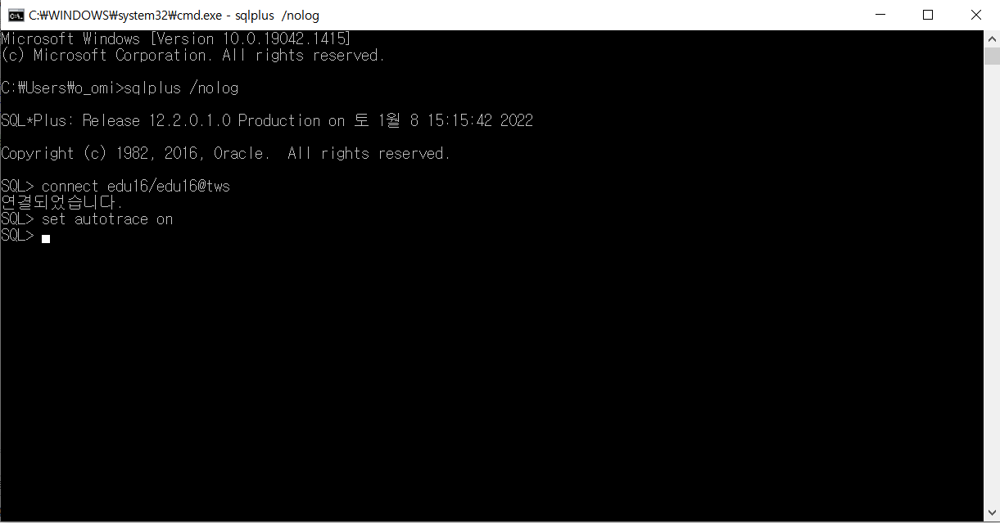

사용 ORACLE : 12C

ORACLE TOOL : QueryBox 3.4.2.4 
###### ~~무슨 버전이 이따구로 생겼어...~~

---

MD 파일 읽는 요령
- 모르는 단어, 문장, 개념 등은 보라색으로 표시헀습니다
```
<SPAN STYLE='COLOR:#A71FEB'> ? </SPAN>
``` 


----

## 22.1.8

첫 수업

오라클 서적 작가 추천 
1. 조나단 루스 (Jonathan rewis) - 그냥 오라클을 잘함
2. 토마스 카이트 (Thomas Kyte) - 오라클 부사장

<br/><br/>

~~1장은 진도를 빨리 나가야하므로 생략~~

----------

# 2장. 옵티마이저에 대한 이해

DHELPY , VISUAL BASIC ... -> 4세대 언어 <BR/>
SQL은 4세대 언어다.

구조적인 질의로 선언해서 집합적인 데이터를 뽑아낸다.

내부적으로 절차적인 
## 프로시저 
를 만들어낸다.

- 실행 계획을 볼 때 COST의 '2','19' 이런 숫자는 예상되는 I/O CALL 횟수를 가리킨다.
    - 읽는 SINGLE BLOCK I/O수와는 같을 수 있지만 MULTI BLOCK I/O 횟수는 아니다. 어쨌뜬 BLOCK과 COST는 별개의 숫자.
    - 상대적인 시간개념이다. 즉, 내 시스템에서 이만큼의 시간이 걸린다이지 절대적인 시간은 아니다. 내 시스템에선 10초가 걸려도 남의 시스템에선 5초가 걸수도 20초가 걸릴수도 있음.

<BR/><BR/><BR/>

## ※※ 통계정보 관리는 정말 중요합니다 ※※
### 오브젝트 통계 항목 : DBA들이 수집합니다. -> 이렇게 모은 통계정보 기반으로 CBO 옵티마이저가 경로를 정함

- 컬럼 값의 수
    - 통계에서 중요한 개념
        - NDV (NUMBER DISTINCT VALUE) : 중복을 제외한 값
            - 남녀 성별을 은 NDV는 2개, 선택도는 1/2, 카디널리티

- 컬럼 값 분포

<BR/><BR/><BR/>
## 옵티마이저 HINT
```
SELECT count(*) FROM v$sql_hint;
SELECT * FROM v$sql_hint;
```
옵티마이저 힌트는 명령어라서 옵티마이저가 무조건적으로 따른다.

옵티마이저가 힌트를 실행 안 하는 경우
- 문법이 틀렸다
- 논리적으로 불가능한 액세스 경로
    - null허용 컬럼에 대한 인덱스 : 오라클은 null을 인덱스에 담지 않아요..
- unnest, push_subq 
- 옵티마이저에 의해 내부적으로 쿼리가 변환된 경우
    - 인라인뷰가 풀려서 조인이 된다거나 하는 경우

### 각각 힌트의 내부 작동 원리를 아는게 중요!

<SPAN STYLE='COLOR:#A71FEB'> SPM : 힌트를 담는 기능(?)</SPAN>

오라클의 경우 자동으로 잡 스케쥴러가 만들어짐
매일 밤 10시부터 아침 6시까지 
토요일은 새벽 0시부터 2일동안 윈도우가 오픈되어 돌아감

배치프로그램 시간과 맞물리지 않도록 조심

실시간 통계 스케쥴러가 있기는 하지만 위 사항때문에 꺼놓음
<BR/><BR/><BR/>
## SQL 처리 과정

- 파싱
- 최적화
    - 쿼리 트랜스포머
        - 인라인 뷰를 풀어내기도 하고 그런 일은 얘가 함
    - 옵티마이저가 실행
        - 논리적인 형태
- 로우소스생성
    - 실제 물리적인 형태
    - 프로시저가 실행
- SQL실행

<BR/><BR/><BR/>
SQL*PLUS 시간 보여주려면
```
SET TIMING ON
```
캐시메모리 비우기
```
ALTER SYSTEM FLUSH SHARED_POOL;
```
``` 
LATCH : SHARED POOL -> 하드 파싱중에 나오는 것
```

~~만약 DB가 정전되면
모든 시스템이 내려갈텐데
버퍼부터 라이브러리 캐시까지 다 내려간 초기화 상태에선 자연스럽게 데이터가 하나씩 다시 올라갑니다. 특별히 해줄 건 없음.~~

<br/><br/><br/>

## CURSOR
### Library cache의 cursor 공유

커서를 공유한다.
자바 어플리케이션에서 QUERY CURSOR로 연결이 들어오면 PGA 영역의 CURSOR를 찾아가고 그 PGA 영역의 CURSOR는 Library Pool의 CURSOR를 찾고 있으면 실행하고 없으면 최적화과정을 거쳐 프로시저 만들고 실행까지 갑니다.

### 세 가지 커서

- SGA(SYSTEM GLOBAL AREA)의 라이브러리캐쉬 영역 커서
    - 공유커서 SHARED
    - SGA : SYSTEM을 위한 공유 영역
- PGA(PROGRAM,PRIVATE,PROCESS GLOBAL AREA) 영역 커서
    - 세션커서 SESSION
    - PGA : PROCESS만을 위한 사적인 영역
- APP 영역 커서
    - 애플리케이션커서 APPLICATION

Initial fetch : 100
Next fetch : 10

## 바인드 변수에도 부작용이 있다

- 컬럼분포를 활용 할 수 없다 
    - 즉, 인덱스 활용이 어려워짐, 풀스캔을 해도 문제.. 인덱스를 타도 문제..


이 수업에서 할 쿼리

- OLTP : ONLINE TRANSACTION PROCESSING -> 특정 고객, 특정 상품 등 조회 
    - INDEX를 잘 타고 그런 튜닝
<BR/>
- OLAP/DW : ONLINE ANNALIZE PROCESSING -> 전체에 대한 분석작업
    - PARTITION을 어떻게 나누느냐 그런 튜닝

- 이런 바인드 변수 부작용을 줄여보고자 오라클이 한 노력들 (하지만 전부 쓰지 않는다고 한다..)
    - 바인드변수 PEEKING

    - 적응적 커서 공유

    - 카다널리티 FEEDBACK

----

## 1장 SQL 분석 도구

----

### SQL Trace 분석이 정말 중요

SQL*PLUS에서 실행계획 예쁘게 포맷팅해서 보여주는 명령어

```
EXPLAIN PLAN
SELECT * FROM EMP

-- SQL*PLUS에서
@?/rdbms/admin/utlxpls
```

```SQL
SELECT PLAN_TABLE_OUTPUT 
FROM TABLE(DBMS_XPLAN.DISPLAU('PLAN_TABLE',NULL,'ALL'));
````

쿼리박스에선 ``` CTRL + E ```

## AUTOTRACE 설정하기



쿼리박스에서 


##### 오라클은 데이터를 읽을 때 복사본을 만들어서 읽는데 컨시스턴트(? 커런트?) 모드로 읽으면 원본에 락을 걸게 되므로 커렌트 결과도 나온다
##### ~~아오... 뭔가 까면 깔수록 뭐ㅓ가 자꾸 나온다..~~
##### ~~오라클 성능 고도화 해법.. 읽어야겠다...~~
##### mscc..? #####

oracle의 ``` net manager ``` 를 사용하면 ``` tns ``` 서버를 저장 할 수 있음!


## v$sql

이 v$sql을 잘 사용해야함!
io기준 시간 기준으로 튜닝대상을 뽑아 낼 수도 있음

## DBMS_XPLAN 패키지

SQL TRACE 파일로 떨구는게 아니라 메모리에 남기는 방법

DBA들이 나에게 트레이스에 대한 권한을 주지 않을경우 TRACE 파일을 보는방법


```SQL
SELECT PLAN_TABLE_OUTPUT 
FROM TABLE(DBMS_XPLAN.DISPLAY('PLAN_TABLE','ALL'));
````

라이브러리에 캐싱된 커서 정보로 실제 실행을 볼 수 있음

```SQL
SELECT *
FROM 
TABLE(DBMS_XPLAN.DISPLAY_CURSOR('$SQL_ID','$CHILD_NO','[OPRIONS]'));
````
여기서 $SQL_IDDHK $CHILD_NO 는 V$SQL의 결과에서 확인

저 두개의 값을 비워두면 직전에 실행한 쿼리를 자동으로 보여줌

이 실행계획은 실제 실행계획이지만 여기서 나온 rows와 cost는 옵티마이저가 예상한 건수입니다.

그럼 진짜 실행 건수는 어디있어요?? 

그러려면 hint를 줘야합니다

자꾸 실행계획이 안나오는 경우가 있다.
SQL*PLUS에선 다른 SQL이 내부적으로 실행 되는 경우

```SQL
SET SERVEROUTPUT OFF
```
이 명령어를 통해 SERVEROUTPUT 을 OFF로 돌린다


다른 쿼리툴에선 이렇게 ALIAS를 통해서 하면 됩니다~
```SQL
-- 1
SELECT /*+ GATHER_XPLAN_STATISTICS MYMY */ *
  FROM SCOTT.EMP E, SCOTT.DEPT D

-- 2
SELECT * 
FROM V$SQL 
WHERE SQL_TEXT LIKE '%GATHER_PLAN_STATISTICS MYMY %'

--3
SELECT * 
  FROM TABLE(DBMS.XPLAN.DISPLAY_CURSOR(NULL,NULL,'ALLSTATS LAST'));

```

<BR/><BR/>
## 3장 데이터 I/O 메커니즘

오늘의 주요 주제는 옵티마이저였던거 같습니다.

옵티마이저가 얼마나 I/O를 최소화 하는지 실행계획을 살펴봤습니다.

결국 SQL튜닝은 I/O의 최소화입니다

TABLESPACE를 만드는 쿼리
```sql
CREATE TABLESPACE mytbs
DATAFILE 'C:\ORACLE\mytbs.dbf' SIZE 100M;

ALTER TABLESPACE mytbs ADD DATAFILE 'C:\...' 100M;
```

그 다음 세그먼트를 만듭니다.

세그먼트 : 데이터 저장 공간을 필요로 하는 오브젝트를 세그먼트라고 함.
- 테이블
- 인덱스 등등

테이블을 특정 테이블스페이스에 저장하기
```sql
CREATE TABLE ( ...) 
TABLESPACE mytbs
```

그러면 이 세그먼트가 테이블스페이스에 있는 익스텐트를 가져갑니다.
테이블스페이스엔 많은 익스텐트들이 있습니다.
그걸 세그먼트가 가져갑니다.
```
SELECT * 
  FROM DBA_EXTENTS
WHERE TABLESPACE_NAME = 'mytbs';
```


요즘 버전엔 익스텐트 없는 테이블스페이스도 있습니다. (디퍼드..뭐시기..몰라도 된대요)

그 익스텐트엔 블락이 있습니다.
그 블락은 I/O의 단위입니다.

<br/><br/><br/>
시스템 통계를 보는 명령어
```
sys.aux_stats$
```

