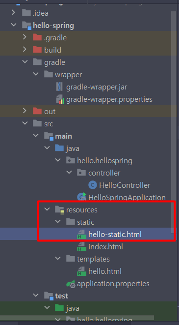
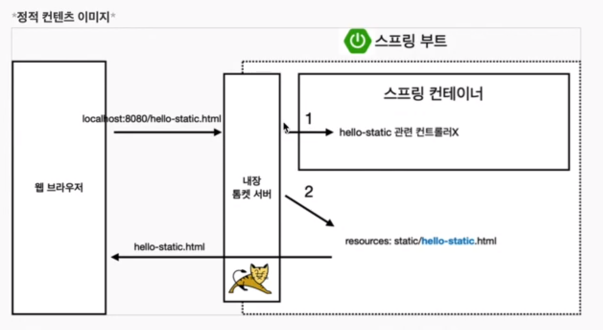

# 스프링 웹 개발 기초

1. 정적컨텐츠
2. MVC와 템플릿 엔진
3. API

스프링 부트는 정적컨텐츠 기능을 제공합니다.
정적 소스 위치는 ``` resources > static > ``` <br/>
server에서 호출 할 땐 8080 포트 아래에 바로 정적파일 이름 써주시면 됩니다.




## 어떤 원리로 작동하는가



1. 스프링이 hello-static.html이란 요청을 받는 컨트롤러가 있는지 살펴봅니다

2. 없으면 내부 스태틱 파일중 hello-static.html을 찾고 반환 해줍니다.


